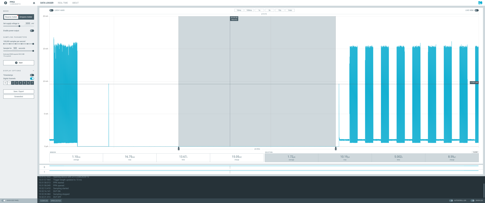
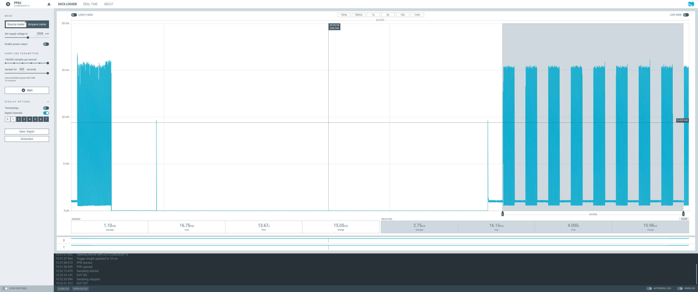

# Project Management

## Init

```bash
mkdir project-nrf-leak-detector
cd project-nrf-leak-detector
docker run --rm -it -u $(id -u):$(id -g) -v $(pwd):/workdir/project nordicplayground/nrfconnect-sdk:v2.1-branch bash
west init -m https://github.com/fgervais/project-nrf-leak-detector.git .
west update
```

## Build

```bash
cd application
docker compose run --rm nrf west build -b my_board -s app
```

## menuconfig

```bash
cd application
docker compose run --rm nrf west build -b my_board -s app -t menuconfig
```

## Clean

```bash
cd application
rm -rf build/
```

## Update

```bash
cd application
docker compose run --rm nrf west update
```

## Flash

### nrfjprog
```bash
cd application
docker compose -f docker-compose.yml -f docker-compose.device.yml \
        run --rm nrf west flash
```

### pyocd
```bash
cd application
pyocd flash -e sector -t nrf52840 -f 4000000 build/zephyr/zephyr.hex
```

# Hardware

https://github.com/fgervais/project-nrf-leak-detector_hardware

## Power Consumption

Based on revision [`ff65151e477efaec1259688cf5fb03853c3a1412`](https://github.com/fgervais/project-nrf-leak-detector/tree/ff65151e477efaec1259688cf5fb03853c3a1412/app/src).

### Idle



How long can the device monitor for a leak?

- Energizer CR2032 = $810 \\, C$
- Idle consumption = $1.72 \\, \frac{{\mu}C}{s}$

```math
\frac{810 \, C}{1.72 \times 10^-6 \, \frac{C}{s}} = 470.93 \times 10^6 \, s
```

```math
470.93 \times 10^6 \, seconds \times \frac{1 \, minute}{60 \, second} \times \frac{1 \, hour}{60 \, minute} \times \frac{1 \, day}{24 \, hour} \times \frac{1 \, year}{365.25 \, days} = 14.92 \, years
```

Note: This does not account for the battery self discharge and the battery voltage
going down over time.

### Alarm


